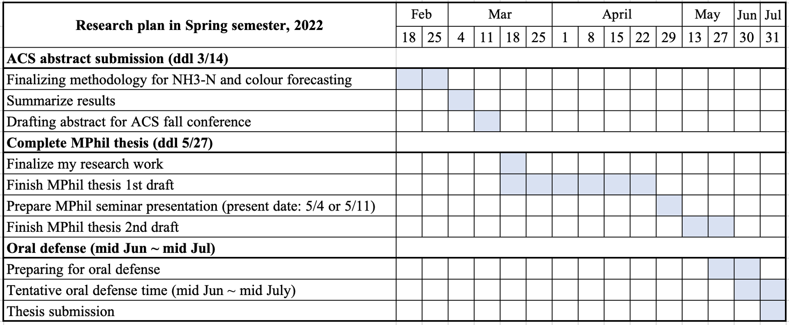

# Progress report to PI (last week of March)
## What has been done in March
---
* Nov 29th &rarr; Group presentation
    * Use RF, DNN, and LSTM models to forecast ammonia.
    * Models were trained with different input size and with or without data smoothing filter.  
    (Ammonia data was collected in May and June.)
* Dec 15th &rarr; Discuss thesis outline structure with Dr. Yin. 
* Jan 21th &rarr; Group presentation
    * Use 5 more models to forecast ammonia.
    * Introduce a new data smoothing filter and outlier removal method to perform data cleaning.  
    (Ammonia data was collected in Nov and Dec.)
* Feb 21th &rarr; Progress report to Dr. Yin (to confrim the ACS abstract content)
* Feb 25th &rarr; Last day of calibrating colour spectrophotometer in SHW.
* March 10th &rarr; Submission of ACS abstract.
* March 18th &rarr; Wrap up the coverage of my reserach coverage?
---
* Apr 22th &rarr; Group presentation.
* May 11th &rarr; EVNG 6050X presentation.
* June 
* Jul 
* Aug

## Progress report
__Key findings__
1. Train ammonia forecasting model with colour decreased the model performance.
2. New method was used to increase the model training data quality (i.e., feature engineering).
3. New state-of-the-art model (Transformer) is used and a better model performance is achieved compared to LSTM and DNN.

## 

