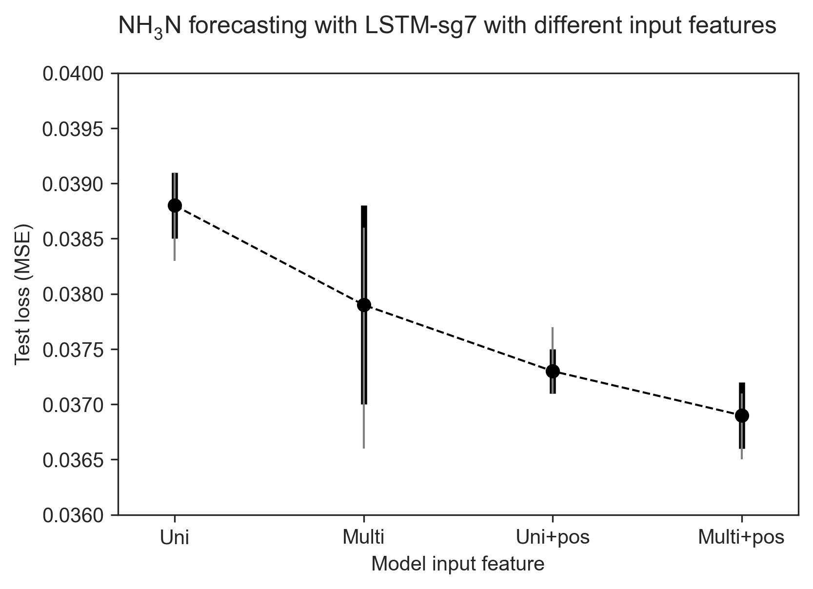

# NH3 vs NH3+colour forecasting NH3
## NH$_{3}$N vs NH3+colour

|Rank|Model-Dataset|Test loss|Improvement|
|:---:|:---|:---:|:---:|
|1 |LSTM-ew3|0.0379 \pm0.0009|**3.32%**|
|2 |LSTM-sg7|0.0379 \pm0.0004|**4.77%**|
|3 |LSTM-ew4|0.0380 \pm0.0003|**2.06%**|
|4 |GRU-ew3 |0.0386 \pm0.0004|**1.53%**|
|5 |LSTM-sg5|0.0387 \pm0.0004|**4.44%**|
|6 |LSTM-ew2|0.0389 \pm0.0004|**1.77%**|
|7 |GRU-sg7 |0.0390 \pm0.0009|-1.30%|
|8 |GRU-sg5 |0.0392 \pm0.0008|**3.21%**|
|9 |GRU-ew4 |0.0394 \pm0.0004|-0.77%|
|10|GRU-sg9 |0.0400 \pm0.0010|-4.44%|
|11|GRU-ew2 |0.0402 \pm0.0012|-3.34%|
|12|LSTM-sg9|0.0409 \pm0.0006|-5.41%|
|13|LSTM-obs|0.0411 \pm0.0007|-4.05%|
|14|RNN-sg5 |0.0413 \pm0.0009|**0.48%**|
|15|RNN-sg7 |0.0417 \pm0.0007|**1.42%**|
|16|GRU-obs |0.0420 \pm0.0006|-1.45%|
|17|RNN-ew2 |0.0424 \pm0.0006|-9.28%|
|18|RNN-ew3 |0.0426 \pm0.0003|-3.90%|
|19|RNN-ew4 |0.0427 \pm0.0005|-1.43%|
|20|RNN-obs |0.0437 \pm0.0012|-1.16%|

Table: Evaluation of multivariate models in forecasting NH$_{3}$N. {#tbl:id}

\pagebreak

## NH$_{3}$N + pos vs NH3 + colour + pos

|Rank|LSTM-3|Test loss|LSTM-4|Test loss|Improvement|
|:---:|:---:|:---:|:---:|:---:|:---:|
|1 |sg7|0.0373 \pm 0.0002|sg7|0.0369 \pm0.0003|1.07% |
|2 |sg9|0.0391 \pm 0.0004|sg9|0.0384 \pm0.0001|1.79% |
|3 |sg5|0.0392 \pm 0.0009|ew3|0.0392 \pm0.0007|1.26% |
|4 |ew3|0.0397 \pm 0.0007|sg5|0.0397 \pm0.0002|-1.28%|
|5 |ew4|0.0400 \pm 0.0001|ew4|0.0399 \pm0.0007|0.25% |
|6 |ew2|0.0403 \pm 0.0008|ew2|0.0404 \pm0.0007|-0.25%|
|7 |obs|0.0426 \pm 0.0005|obs|0.0432 \pm0.0009|-1.41%|

Table: Comparison of univariate and multivariate models trained with postional encoding in forecasting NH$_{3}$N. {#tbl:id}

\pagebreak

# NH3 vs NH3+colour forecasting colour
## Colour vs colour + nh3

|Rank|Model-Dataset|Test loss|Improvement|
|:---:|:---|:---:|:---:|
|1 |LSTM-ew3|0.0132\pm0.0001|**4.35%**|
|2 |LSTM-ew4|0.0135\pm0.0002|**2.17%**|
|3 |LSTM-ew2|0.0139\pm0.0002|**7.95%**|
|4 |GRU-ew4 |0.0140\pm0.0001|**2.10%**|
|5 |GRU-ew3 |0.0142\pm0.0003|-1.43%|
|6 |GRU-ew2 |0.0143\pm0.0002|-0.70%|
|7 |GRU-sg9 |0.0145\pm0.0002|**8.81%**|
|8 |LSTM-sg9|0.0146\pm0.0001|-2.10%|
|9 |RNN-ew4 |0.0147\pm0.0002|**0.00%**|
|10|RNN-ew3 |0.0149\pm0.0001|**0.00%**|
|11|GRU-obs |0.0149\pm0.0002|-3.47%|
|12|RNN-sg9 |0.0151\pm0.0002|-0.67%|
|13|RNN-ew2 |0.0151\pm0.0002|-2.72%|
|14|LSTM-obs|0.0152\pm0.0001|-11.76%|
|15|LSTM-sg7|0.0154\pm0.0007|**4.35%**|
|16|GRU-sg5 |0.0158\pm0.0004|**1.25%**|
|17|RNN-sg7 |0.0159\pm0.0005|-7.43%|
|18|LSTM-sg5|0.0159\pm0.0006|**0.62%**|
|19|RNN-obs |0.0159\pm0.0002|-0.63%|
|20|RNN-sg5 |0.0163\pm0.0003|-3.16%|

Table: Evaluation of multivariate models in forecasting colour. {#tbl:id}

\pagebreak

## colour + pos vs NH3 + colour + pos

|Rank|LSTM-3|Test loss|LSTM-4|Test loss|Improvement|
|:---:|:---:|:---:|:---:|:---:|:---:|
|1 |sg9|0.0120 \pm 0.0007|sg9|0.0129 \pm0.0007|-7.50%|
|2 |ew2|0.0132 \pm 0.0004|ew3|0.0136 \pm0.0005|-1.49%|
|3 |ew3|0.0134 \pm 0.0004|sg7|0.0136 \pm0.0005|4.90% |
|4 |ew4|0.0135 \pm 0.0003|ew4|0.0137 \pm0.0003|-1.48%|
|5 |obs|0.0135 \pm 0.0001|obs|0.0140 \pm0.0001|-3.70%|
|6 |sg7|0.0143 \pm 0.0003|ew2|0.0141 \pm0.0001|-6.82%|
|7 |sg5|0.0144 \pm 0.0002|sg5|0.0155 \pm0.0003|-7.64%|

Table: Comparison of univariate and multivariate models trained with postional encoding in forecasting colour. {#tbl:id}

# NH3/colour forecasting NH3
## Multivariate NH$_{3}$N forecasting model, baseline performance

|Rank|Model-Dataset|Test loss|Valid loss|
|:---:|:---|:---:|:---:|
|1 |LSTM-ew3|0.0379 \pm0.0009|1.0702 \pm0.0067|
|2 |LSTM-sg7|0.0379 \pm0.0004|1.1582 \pm0.0159|
|3 |LSTM-ew4|0.0380 \pm0.0003|1.0641 \pm0.0087|
|4 |GRU-ew3 |0.0386 \pm0.0004|1.1137 \pm0.0268|
|5 |LSTM-sg5|0.0387 \pm0.0004|1.1531 \pm0.0323|
|6 |LSTM-ew2|0.0389 \pm0.0004|1.0909 \pm0.0241|
|7 |GRU-sg7 |0.0390 \pm0.0009|1.3082 \pm0.0383|
|8 |GRU-sg5 |0.0392 \pm0.0008|1.1839 \pm0.0114|
|9 |GRU-ew4 |0.0394 \pm0.0004|1.2183 \pm0.0324|
|10|GRU-sg9 |0.0400 \pm0.0010|1.2075 \pm0.0283|
|11|GRU-ew2 |0.0402 \pm0.0012|1.1545 \pm0.0292|
|12|LSTM-sg9|0.0409 \pm0.0006|1.2460 \pm0.0058|
|13|LSTM-obs|0.0411 \pm0.0007|1.1552 \pm0.0109|
|14|RNN-sg5 |0.0413 \pm0.0009|1.4160 \pm0.0397|
|15|RNN-sg7 |0.0417 \pm0.0007|1.4258 \pm0.0365|
|16|GRU-obs |0.0420 \pm0.0006|1.2439 \pm0.0131|
|17|RNN-ew2 |0.0424 \pm0.0006|1.3500 \pm0.0644|
|18|RNN-ew3 |0.0426 \pm0.0003|1.4554 \pm0.0408|
|19|RNN-ew4 |0.0427 \pm0.0005|1.5066 \pm0.0359|
|20|RNN-obs |0.0437 \pm0.0012|1.4610 \pm0.0628|

Table: Evaluation of multivariate models of each NH$_{3}$N forecasting approach. {#tbl:id}

\pagebreak

## NH$_{3}$N forecasting, LSTM LSTM-4 comparison

|LSTM|Test loss|LSTM-4[^2]|Test loss|
|:---:|:---|:---:|:---|
|sg7|0.0379 \pm0.0009|sg7|0.0369 \pm0.0003|
|ew3|0.0379 \pm0.0004|sg9|0.0384 \pm0.0001|
|ew4|0.0380 \pm0.0003|ew3|0.0392 \pm0.0007|
|sg5|0.0387 \pm0.0004|sg5|0.0397 \pm0.0002|
|ew2|0.0389 \pm0.0004|ew4|0.0399 \pm0.0007|
|sg9|0.0409 \pm0.0006|ew2|0.0404 \pm0.0007|
|obs|0.0411 \pm0.0007|obs|0.0432 \pm0.0009|

Table: Evaluation of NH$_{3}$N forecasting models trained with positional encoding. {#tbl:id}

[^2]: Number 4 stands for the number of features.

\pagebreak

# NH3/colour forecasting colour
## Multivariate colour forecasting model, baseline performance

|Rank|Model-Dataset|Test loss|Valid loss|
|:---:|:---|:---:|:---:|
|1 |LSTM-sg9|1.5358 \pm0.0001|0.7016 \pm0.0129|
|2 |GRU-sg9 |1.7454 \pm0.0002|0.7415 \pm0.0153|
|3 |LSTM-sg7|1.8177 \pm0.0002|0.7633 \pm0.0236|
|4 |GRU-sg7 |1.9366 \pm0.0001|0.7463 \pm0.0333|
|5 |RNN-sg9 |2.0959 \pm0.0003|0.8345 \pm0.0088|
|6 |RNN-sg7 |2.4952 \pm0.0002|0.8160 \pm0.0256|
|7 |LSTM-ew4|2.9674 \pm0.0002|0.7590 \pm0.0275|
|8 |GRU-ew4 |3.0119 \pm0.0001|0.7475 \pm0.0152|
|9 |RNN-ew4 |3.3010 \pm0.0002|0.8599 \pm0.0021|
|10|LSTM-sg5|3.3376 \pm0.0001|0.8231 \pm0.0351|
|11|LSTM-ew3|3.4504 \pm0.0002|0.7473 \pm0.0236|
|12|GRU-sg5 |3.5714 \pm0.0002|0.7687 \pm0.0112|
|13|GRU-ew3 |3.8090 \pm0.0002|0.7899 \pm0.0184|
|14|RNN-sg5 |3.8777 \pm0.0001|0.8963 \pm0.0192|
|15|RNN-ew3 |3.9121 \pm0.0007|0.8344 \pm0.0111|
|16|DNN-sg9 |4.6878 \pm0.0004|1.4568 \pm0.0132|
|17|LSTM-ew2|4.7100 \pm0.0005|0.7855 \pm0.0316|
|18|GRU-ew2 |4.8043 \pm0.0006|0.8067 \pm0.0070|
|19|RNN-ew2 |4.9021 \pm0.0002|0.8804 \pm0.0285|
|20|DNN-sg7 |5.1713 \pm0.0003|1.4630 \pm0.0244|

Table: Evaluation of multivariate models of each colour forecasting approach. {#tbl:id}

\pagebreak

## LSTM LSTM-4 comparison

|LSTM|Test loss|LSTM-4[^1]|Test loss|
|:---:|:---|:---:|:---|
|ew3|0.0132 \pm0.0001|sg9|0.0129 \pm0.0007|
|ew4|0.0135 \pm0.0002|sg7|0.0136 \pm0.0005|
|ew2|0.0139 \pm0.0002|ew3|0.0136 \pm0.0005|
|sg9|0.0146 \pm0.0001|ew4|0.0137 \pm0.0003|
|obs|0.0152 \pm0.0001|obs|0.0140 \pm0.0001|
|sg7|0.0154 \pm0.0007|ew2|0.0141 \pm0.0001|
|sg5|0.0159 \pm0.0006|sg5|0.0155 \pm0.0003|

Table: Evaluation of colour forecasting models trained with positional encoding. {#tbl:id}

[^1]: Number 4 stands for the number of features.

\pagebreak

{#fig:id width=50%}