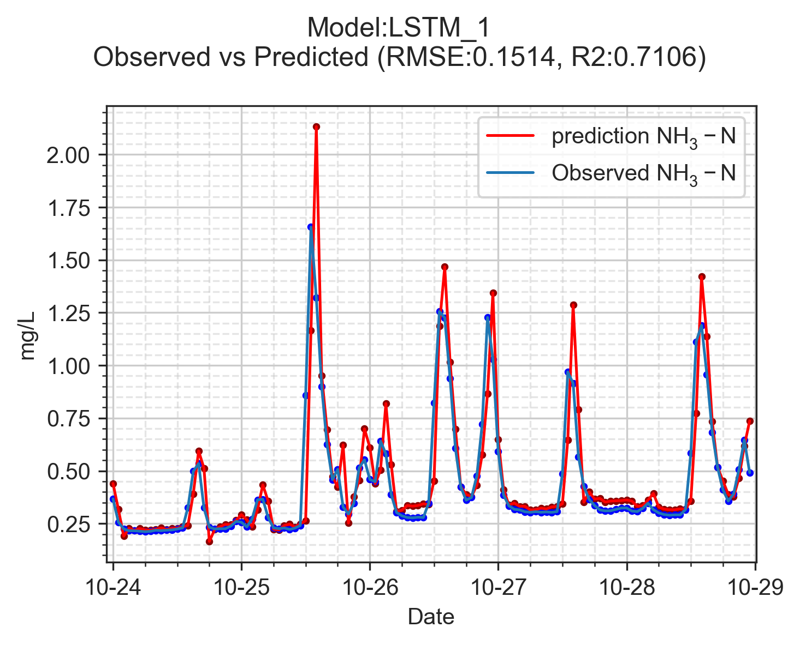

# RESULTS
## Exp-1 (NH$_{3}$N baseline model)
### Keys
* [ ] The benefit of data pre-processing by comparing validation and test loss.
* [ ] The selection of best model by comparing validation and test loss.
* [ ] Test data could be in poor quality.
* [ ] Show another test data results and compare the test and valid loss.

### Fig and table
* Result 1 - To select the best algorithm for training NH$_{3}$N forecasting model.

|GRU|Test loss mean|Valid loss mean|LSTM|Test loss mean|Valid loss mean|
|:---:|:---:|:---:|:---:|:---:|:---:|
|sg7	  |0.0383|1.2508|    ew3|	 0.0388|**1.0796**(1)|
|sg5	  |0.0385|1.2644|    sg7|	 0.0388|1.1804|
|ew2	  |0.0389|**1.1891**(1)|    sg5|	 0.0388|1.2346|
|ew4	  |0.0391|**1.2390**(3)|    ew2|	 0.0392|**1.0969**(2)|
|ew3	  |0.0392|**1.2199**(2)|    ew4|	 0.0395|**1.1219**(3)|
|sg9	  |0.0396|1.3097|    or |    0.0398|1.2612|
|or	      |0.0405|1.3993|    obs|    0.0405|1.2366|
|obs	  |0.0414|1.3638|    sg9|	 0.0410|1.3076|

Table: Comparison of NH$_{3}$N val and test loss from 1/16 to 1/22. {#tbl:id}

|GRU|Test loss mean|Valid loss mean|LSTM|Test loss mean|Valid loss mean|
|:---:|:---:|:---:|:---:|:---:|:---:|
|ew3|0.0167|**1.2199**(2)|ew2|0.0161|**1.0969**(2)|
|ew4|0.0169|**1.2390**(3)|ew3|0.0158|**1.0796**(1)|
|ew2|0.0170|**1.1891**(1)|ew4|0.0163|**1.1219**(3)|
|sg9|0.0174|1.3097|obs|0.0175|1.2366|
|sg5|0.0178|1.2644|or|0.0177|1.2612|
|sg7|0.018|1.2508|sg5|0.0166|1.2346|
|or|0.0187|1.3993|sg7|0.018|1.1804|
|obs|0.0189|1.3638|sg9|0.0188|1.3076|

Table: Comparison of NH$_{3}$N val and test loss from 10/10 to 10/16. {#tbl:id}

|Model-dataset|Validation Loss|Model-dataset    |Test loss|
|:---         |:---:          |:---             |:---:    |
|LSTM-ew3	    |1.0796         |__GRU-sg7__	    |0.0383   |
|LSTM-ew2	    |1.0969         |GRU-sg5	        |0.0385   |
|LSTM-ew4	    |1.1219         |__LSTM-ew3__	    |0.0388   |
|LSTM-sg7	    |1.1804         |__LSTM-sg7__	    |0.0388   |
|GRU-ew2	    |1.1891         |__LSTM-sg5	__    |0.0388   |
|GRU-ew3	    |1.2199         |__GRU-ew2__	    |0.0389   |
|LSTM-sg5	    |1.2346         |__GRU-ew4__	    |0.0391   |
|LSTM-obs	    |1.2366         |__LSTM-ew2__     |0.0392   |
|GRU-ew4	    |1.239          |__GRU-ew3__	    |0.0392   |
|GRU-sg7	    |1.2508         |__LSTM-ew4__	    |0.0395   |

Table: Valid and test loss from 1/16 to 1/22. {#tbl:2}

|Model-dataset|Validation Loss|Model-dataset    |Test loss|
|:---         |:---:          |:---             |:---:    |
|LSTM-ew3	    |1.0796         |__LSTM-ew3__	    |0.0158|
|LSTM-ew2	    |1.0969         |__LSTM-ew2__	    |0.0161|
|LSTM-ew4	    |1.1219         |__LSTM-ew4__	    |0.0163|
|LSTM-sg7	    |1.1804         |__LSTM-sg5__	    |0.0166|
|GRU-ew2	    |1.1891         |__GRU-ew3__	    |0.0167|
|GRU-ew3	    |1.2199         |__GRU-ew4__	    |0.0169|
|LSTM-sg5	    |1.2346         |__GRU-ew2__	    |0.0170|
|LSTM-obs	    |1.2366         |GRU-sg9	        |0.0174|
|GRU-ew4	    |1.239          |__LSTM-obs__	    |0.0175|
|GRU-sg7	    |1.2508         |LSTM-or	        |0.0177|

Table: Valid and test loss from 1/16 to 1/22. {#tbl:3}

| Reagent                  | Amount   |
| ------------------------ | -------- |
| Appropriate Buffer (10x) | 1x       |
| DNA                      | 50-500ng |
| Restriction Enzyme       | 1*U*     |
| Water                    | -        |

Table: {#tbl:restriction-generic} Schematic for restriction digestion with a single restriction enzyme. Some really long text that shows how the caption is formatted when it takes multiple lines.

## Exp-2

## Exp-5

## Exp-6
# Result
## sdfas
|Model-dataset|Validation Loss|
|:---         |:---: |
|LSTM-ew3	    |1.0796|
|LSTM-ew2	    |1.0969|
|LSTM-ew4	    |1.1219|

Table: Validation and test loss comparison from 1/16 to 1/22. {#tbl:2}

## asdf
|Model-dataset|Validation Loss|Model-dataset|Test loss|
|:---         |:---: |:---            |:---: |
|LSTM-ew3	    |1.0796|GRU-sg7	        |0.0383|
|LSTM-ew2	    |1.0969|GRU-sg5	        |0.0385|
|LSTM-ew4	    |1.1219|__LSTM-ew3__	  |0.0388|

Table: Validation and test loss comparison from 1/16 to 1/22. {#tbl:2}

Thanks, it works. But I have another problem now. My images are a little large, and when put in the same row they cannot fit into one slide. Is it possible to control the size of the image? Thanks, it works. But I have another problem now. My images are a little large, and when put in the same row they cannot fit into one slide. Is it possible to control the size of the image? Thanks, it works. But I have another problem now. My images are a little large, and when put in the same row they cannot fit into one slide. Is it possible to control the size of the image? Thanks, it works. But I have another problem now. My images are a little large, and when put in the same row they cannot fit into one slide. Is it possible to control the size of the image? 

{#fig:id width=50%}

Thanks, it works. But I have another problem now. My images are a little large, and when put in the same row they cannot fit into one slide. Is it possible to control the size of the image? Thanks, it works. But I have another problem now. My images are a little large, and when put in the same row they cannot fit into one slide. Is it possible to control the size of the image? Thanks, it works. But I have another problem now. My images are a little large, and when put in the same row they cannot fit into one slide. Is it possible to control the size of the image?
